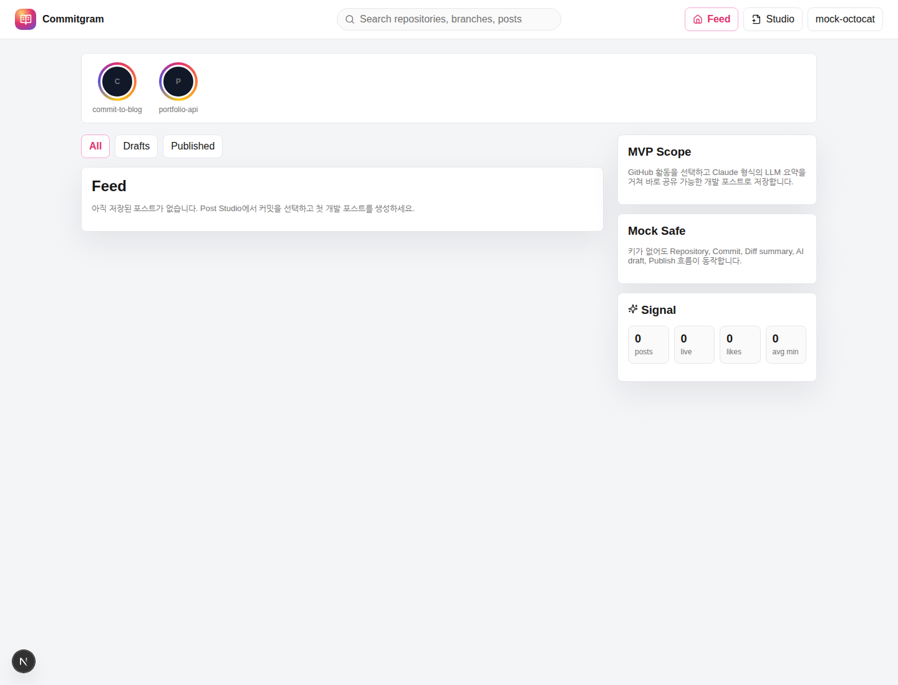

# PR Description Draft

PR 제목: `[학부명_실명] - AI 개발 workflow와 서비스 구조 문서화`

## 완료 작업 목록

- 이번 주 기능 개발 리스트를 이슈 단위로 계획하고 `docs/weekly-plan.md`에 정리했습니다.
- `service-design-review` Skill을 추가해 구현 전 요구사항, 영향 범위, 검증 방법을 먼저 확인하도록 했습니다.
- `.githooks/pre-commit` hook을 추가해 커밋 전 backend ruff, frontend lint/typecheck를 실행하도록 했습니다.
- README에 AI Development Workflow, Skill, Hook, Service Architecture 요약을 추가했습니다.
- `docs/architecture.md`에 FE, BE, API 호출, DB, 외부 API 경계를 설명했습니다.
- `docs/design-review.md`에 Skill을 적용한 설계 리뷰 기록을 남겼습니다.
- `.github/pull_request_template.md`에 PR 회고 항목을 고정했습니다.
- mock GitHub 로그인 후 실제 동작 화면 스크린샷을 추가했습니다.

## 분석 & 설계 과정

- 요구사항을 한 문장으로 재정의: 기능 구현보다 AI를 활용한 분석/설계 workflow를 설명 가능한 산출물로 남기는 것이 목표라고 정리했습니다.
- 확인한 기존 구조: README, docs, frontend feature 구조, backend domain module 구조, CI/hook 적용 위치를 먼저 확인했습니다.
- 이슈 분리 방식: workflow 문서화, Skill 적용, Hook 적용, 서비스 아키텍처 설명, PR 작성 workflow 고정으로 나눴습니다.
- 선택한 검증 방법: hook 문법 확인, pre-commit hook 실행, 실제 앱 화면 캡처를 통해 문서와 workflow가 동작 가능한 상태인지 확인했습니다.

## 가장 막혔던 순간

- 막힌 지점: 동작 화면 스크린샷을 만들기 위해 Docker compose를 실행하려 했지만 현재 WSL 환경에서 Docker 명령을 사용할 수 없었습니다.
- AI에게 다시 질문한 방식: “Docker가 없을 때 같은 mock 환경을 어떻게 재현해서 스크린샷을 만들 수 있는가?”라는 방향으로 실행 방법을 바꿨습니다.
- 해결 방법: backend와 frontend 개발 서버를 직접 실행하고, Playwright로 mock GitHub 로그인 후 실제 화면을 캡처했습니다.

## 새로 알게 된 것

- AI workflow는 프롬프트만 잘 쓰는 것이 아니라 Skill, hook, 문서, 검증 gate 같은 장치로 반복 가능하게 만들 수 있다는 점을 알게 됐습니다.
- 서비스 구조를 설명하려면 파일 목록만 쓰는 것이 아니라 사용자 액션이 FE, API, BE service, DB, 외부 API를 어떻게 통과하는지 흐름으로 정리해야 한다는 점을 배웠습니다.
- hook에는 너무 무거운 E2E보다 빠르게 실패를 잡는 lint/typecheck를 넣고, 더 무거운 검증은 CI로 분리하는 편이 실용적이라는 점을 알게 됐습니다.

## 다르게 한다면?

- 처음부터 구현 요청을 크게 던지기보다, Issue 1개마다 “설계 질문, 완료 조건, 검증 방법”을 먼저 작성한 뒤 AI에게 맡기겠습니다.
- 스크린샷, PR 본문, 체크리스트 같은 제출 산출물도 마지막에 몰아서 하지 않고 작업 중간마다 함께 갱신하겠습니다.

## 동작 화면 스크린샷

## 체크리스트

- [x] README 또는 docs에 설계/구조 설명을 반영했다.
- [x] Skill 또는 workflow 체크리스트를 사용했다.
- [x] hook 또는 CI gate로 기본 품질 검증을 수행했다.
- [x] 완료하지 않은 작업은 완료 작업 목록에서 제외했다.
- [x] 동작 화면 스크린샷을 포함했다.
